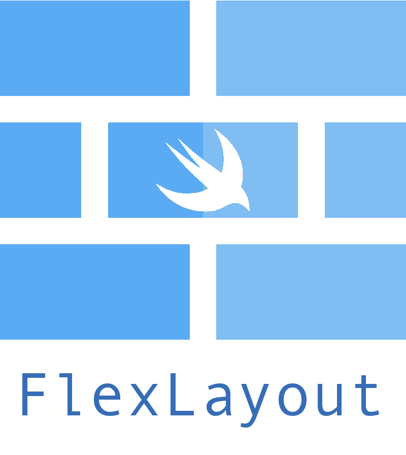
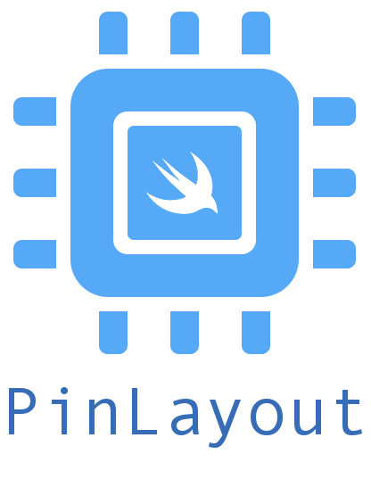

# 로또메이트
로또, 스피또, 연금복권의 정보를 한 곳에서 확인할 수 있는 통합 복권 플랫폼

## 프로젝트 목표
- 🗺️ 통합 복권 정보 및 판매점 지도 서비스:
  - 로또, 연금복권, 스피또 등의 복권 정보를 통합 제공하며, 사용자의 위치를 기반으로 주변 복권 판매점과 당첨 판매점을 지도에서 쉽게 확인할 수 있도록 합니다.
- 기술 연구 및 적용:
  - RxSwift와 FlexLayout 등 기술을 연구하고 이를 프로젝트에 효과적으로 적용합니다. 이러한 기술들을 통해 더 나은 사용자 경험을 제공하고, 코드의 유지보수성을 높이는 것을 목표로 합니다.
- 팀워크와 프로젝트 관리:
  - 정기적인 회의를 통해 프로젝트의 스케줄을 관리하고, 커뮤니케이션 스킬을 향상시키며 협업 경험을 쌓습니다. 이를 통해 팀원 간의 원활한 협력과 프로젝트의 성공적인 완수를 목표로 합니다.

## 사용 기술 
 &nbsp;
 &nbsp;
 &nbsp;
 &nbsp;
 &nbsp;
 &nbsp;
<br>

- Swift(UIKit)
- FlexLayout
- PinLayout
- RxSwift
- Moya
- ReactorKit


## 🗃️ Wiki
이 프로젝트에 대한 모든 정보를 [여기](https://github.com/LottoMate/LottoMate-iOS-public/wiki)에서 확인하실 수 있습니다.

## 빌드 전 필수 설정
이 프로젝트를 로컬에서 빌드하려면 `Config.xcconfig` 파일에 개인 설정값이 필요합니다.

특히 지도 기능 사용을 위해 아래 값을 반드시 입력해야 합니다.
- `NMF_CLIENT_ID` (본인 Naver Maps Client ID)

예시:
```xcconfig
NMF_CLIENT_ID = <YOUR_NMF_CLIENT_ID>
```

생성 순서:
1. `LottoMate/LottoMate/Config.xcconfig.example` 파일을 복사해 `LottoMate/LottoMate/Config.xcconfig` 생성
2. `NMF_CLIENT_ID`에 본인 값을 입력

주의:
- 실제 키/ID가 포함된 파일은 저장소에 커밋하지 마세요.
- 공개용 저장소에는 `Config.xcconfig.example`만 포함하는 것을 권장합니다.
- 공개용 기준으로 `GoogleService-Info.plist`는 포함하지 않습니다.

## Mock 실행 모드
- 기본값은 `Info.plist`의 `DataMode = mock` 입니다.
- `mock` 모드에서는 네트워크 요청 대신 앱 내부 샘플 데이터(`Moya stub`)를 사용합니다.
- 실제 서버 연동이 필요할 경우 `DataMode`를 `live`로 변경하세요.

## 업데이트 정책
- 공개용 버전은 Firebase Remote Config를 사용하지 않습니다.
- 업데이트 비교 값은 `Info.plist`의 `ForceUpdateVersion`, `RecommendedUpdateVersion`를 사용합니다.
